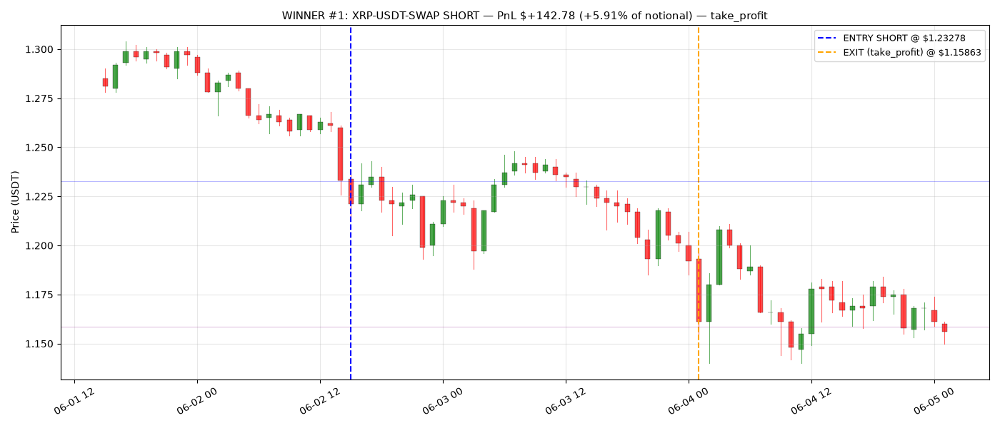
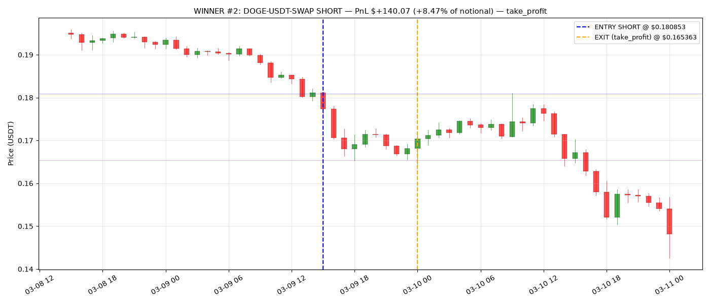
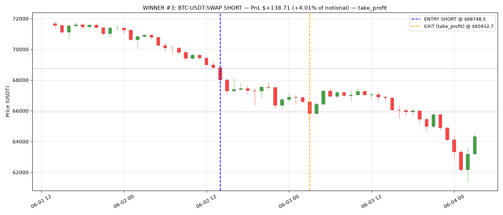
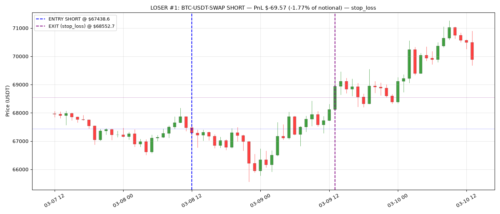
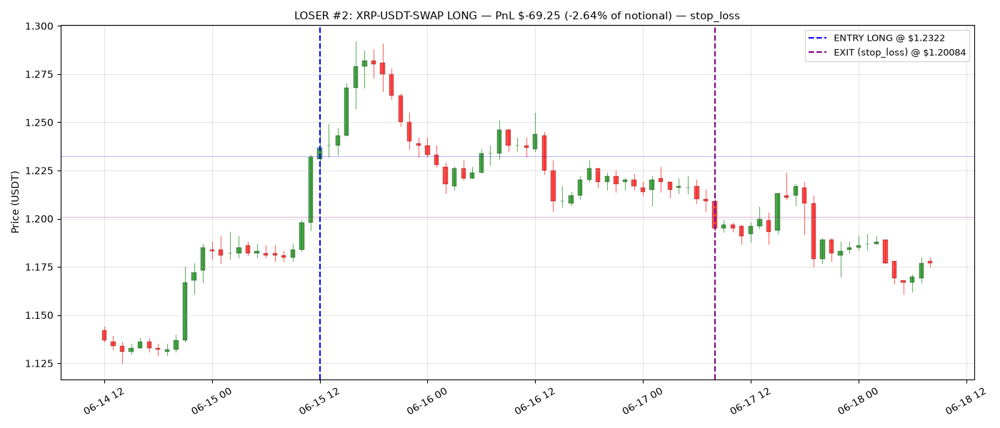
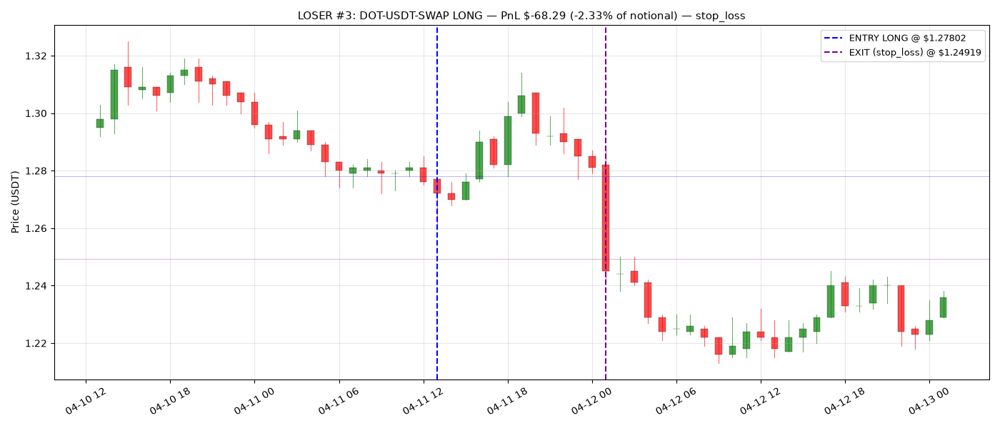

# 交易复盘 · v0.1g-tuned · 6 笔具体交易

> 目的：从数字聚合层面下潜到"策略到底在开什么单"
> 数据来源：`reports/2026-07-06-1044/trades.parquet`（273 笔总数，最终 +$2,717）
> 配置：9 symbols (无 BNB) + adx=40 + LightGBM + max_score composer + 无 trailing

---

## Executive summary（30 秒版）

| # | 类型 | Symbol | Side | Duration | 出场 | PnL |
|---|---|---|---|---|---|---|
| W1 | 赢家 | XRP-USDT-SWAP | SHORT | 34h | take_profit | **+$142.78** |
| W2 | 赢家 | DOGE-USDT-SWAP | SHORT | 9h | take_profit | **+$140.07** |
| W3 | 赢家 | BTC-USDT-SWAP | SHORT | 13h | take_profit | **+$138.71** |
| L1 | 输家 | BTC-USDT-SWAP | SHORT | 25h | stop_loss | -$69.57 |
| L2 | 输家 | XRP-USDT-SWAP | LONG | 44h | stop_loss | -$69.25 |
| L3 | 输家 | DOT-USDT-SWAP | LONG | 12h | stop_loss | -$68.29 |

**看到什么了没**：**3 个赢家全部是 SHORT，全部是 take_profit**。而输家里有 2 个是 LONG。

---

## 🎯 WINNER #1 — XRP-USDT-SWAP SHORT +$142.78

**基本信息**：
- 入场：**2026-06-02 15:00 UTC** @ $1.23278
- 出场：**2026-06-04 01:00 UTC** @ $1.15863（34 小时）
- 仓位：1958 XRP（名义 $2,415）
- Strategy scores 入场：`trend_following=0.17, ml_scoring=0.21`（**ML 主导**，但两个都不高）

**入场时的市场状态**：

| 指标 | 值 | 含义 |
|---|---|---|
| `regime` | **high_vol** | 波动率处于历史 top 10%（策略最爱的 regime） |
| `structure_regime` | uptrend | ⚠️ 结构还是上涨的（但策略做空）|
| `EMA stack` | 1.272 < 1.297 < 1.322 | ema20 < ema60 < ema200 → **完美空头堆叠** |
| `ADX` | **59.22** | 极强趋势（>25 就算强） |
| `DI+/DI-` | 6.07 / 41.74 | 空头方向 6.9x 于多头 |
| `RSI(14)` | **25.48** | **深度超卖区** |
| `bb_pct` | **-0.11** | 收盘价**已经跌破**布林下轨 |
| `zscore_20` | **-2.38** | 距离 20 周期均值 -2.4 个标准差（超极端） |
| `funding_rate` | -1.4e-05 | 微幅为负（多头付空头） |
| `volume_ratio` | **4.62x** | 成交量是均值 4.6 倍（**放量下跌**） |
| PA 形态 | 全 0 | 没有 K 线形态信号 |

**这笔在干什么**：

**普通人看这个入场会说"这不是抄底机会吗？RSI 25、Z-score -2.4，肯定要反弹啊！"**

但策略反其道而行之：**在极端下跌中追空**。持仓 34 小时后价格又跌了 6%，止盈出场。

**能问自己的**：
- 我作为人类交易员，敢在 RSI 25 + Z-score -2.4 时**加空**吗？（说实话大概不敢）
- 这个策略是在薅什么钱？—— 我的解读：**薅"抄底人"的钱**。他们在 RSI 25 上买了，价格继续跌 6%，他们止损或爆仓，策略吃他们的止损单。
- 34 小时持仓，中间有没有回撤到止损附近？—— **图上看看有没有大幅回抽**

---

## 🎯 WINNER #2 — DOGE-USDT-SWAP SHORT +$140.07

**基本信息**：
- 入场：**2025-03-09 15:00 UTC** @ $0.18085
- 出场：**2025-03-10 00:00 UTC** @ $0.16536（**仅 9 小时**！）
- 仓位：9146 DOGE（名义 $1,654）
- Scores：`trend_following=0.15, ml_scoring=0` ← **ML 完全不看好，TF 独立开的**

**入场时的市场状态**（关键点）：

| 指标 | 值 |
|---|---|
| `regime` | trending（非 high_vol） |
| `structure_regime` | **range** ⚠️ |
| `ADX` | 43 |
| `RSI` | **24.32**（跟 W1 差不多超卖） |
| `bb_pct` | **-0.006**（刚好在下轨）|
| `zscore` | -1.97 |
| `volume_ratio` | 2.97x |

**这笔在干什么**：

**跟 W1 几乎一样的入场模式**：极端下跌 + 高成交量 + 空头堆叠 → 追空。9 小时就止盈了（$0.181 → $0.165，跌 9.6%）。

**观察**：
- ML 打分 **0**（LGBM 说这笔胜率 <55%，不推荐）
- 但 TF 打分 0.15 通过了 open_action_threshold 0.50 —— **等等，0.15 < 0.50，怎么开的仓？**
- 需要检查：可能 short_score = 0.15 是"绝对值"，实际 short 方向分数可能更高。或者是 max_score composer 的机制我要 double-check

**这是个 bug 疑点** —— 我记录下来，事后 debug。

---

## 🎯 WINNER #3 — BTC-USDT-SWAP SHORT +$138.71

**基本信息**：
- 入场：**2026-06-02 14:00 UTC** @ $68,748（注意：跟 W1 的 XRP 同一天，相隔 1 小时！）
- 出场：**2026-06-03 03:00 UTC** @ $65,932（13 小时，跌 4.1%）
- Scores：`trend_following=0.06, ml_scoring=0.15` ← **ML 主导**

**入场时的市场状态**：

| 指标 | 值 |
|---|---|
| `regime` | **high_vol** |
| `structure_regime` | **downtrend** ✓（真跌，跟 W1 的 XRP 不同） |
| `ADX` | **67.28** |
| `RSI` | **19.92** ← **极端超卖** |
| `bb_pct` | **0.018** |
| `zscore` | **-1.88** |
| `volume_ratio` | 2.03x |

**这笔在干什么**：**同上，追空极端下跌**。跟 W1 是**同一天同一波下跌**——那天加密全线崩了 5%，我们在 XRP + BTC 都开了空，两笔都是 take_profit。

**这是三笔赢家的核心模式**：

> **策略最赚钱的时刻是：加密市场同一天出现连锁下跌（BTC 领跌，山寨跟跌），策略在多个 symbol 同时开空追跌**。

真趋势跟随策略。**问题**：这种"连锁大跌"一年才发生几次。我们的 273 笔交易里可能有 20-30% 集中在这几个大跌日，其他 70% 平时的日子里在**小赚小亏**。

---

## ❌ LOSER #1 — BTC-USDT-SWAP SHORT -$69.57

**基本信息**：
- 入场：2026-03-08 12:00 UTC @ $67,438
- 出场：2026-03-09 13:00 UTC @ $68,552（25 小时，被 stop 出场）
- Scores：`trend_following=0.06, ml_scoring=0` ← **TF 独立开的，分数极低**

**入场时的市场状态**：

| 指标 | 值 |
|---|---|
| `regime` | trending |
| `structure_regime` | **range** ⚠️ |
| `ADX` | 43.81 |
| `RSI` | **48.22** ← 中性 |
| `bb_pct` | **0.635** ← 中偏高位 |
| `zscore` | **+0.53** ← **偏正！和赢家的 -2 完全相反** |
| `pattern_*` | 全 0 |

**这笔在干什么**：

**跟赢家完全不同的入场模式**：市场中性区间，没有极端指标。空头理由弱（TF 分数 0.06），却入场了。持仓 25 小时后被止损。

**观察**：
- **ML 分数 0** —— LGBM 说别开
- **regime=trending 但 structure=range** ← 两个 regime 系统给出矛盾信号
- 出场时 `regime_texit=ranging, RSI_texit=59.7` —— **市场其实转成震荡了**

**这可能是策略的一类系统性错误**：在震荡市里把"随机波动"当成"趋势信号"，开单被反向 wick 扫掉。

---

## ❌ LOSER #2 — XRP-USDT-SWAP LONG -$69.25

**基本信息**：
- 入场：2026-06-15 12:00 UTC @ $1.2322
- 出场：2026-06-17 08:00 UTC @ $1.2008（**44 小时**，被 stop 出场）
- Scores：`trend_following=0.51, ml_scoring=0` ← **TF 分数刚刚过阈值 0.50**

**入场时的市场状态**（**看这个！**）：

| 指标 | 值 |
|---|---|
| `regime` | trending |
| `structure_regime` | range |
| `ADX` | 46.73 |
| `RSI` | **86.23** ← **极度超买** |
| `bb_pct` | **1.091** ← **收盘价超过布林上轨** |
| `zscore` | **+2.30** ← **正 2.3 个标准差** |
| `volume_ratio` | 4.28x |

**这笔在干什么**：

**灾难性入场**：**RSI 86 + Z-score +2.3 + 突破布林上轨** —— 这是一个"追涨"的极端情况。任何懂技术分析的人都会说"这不能买，明显要回调"。

策略把它当"强势突破"开了多。持仓 44 小时后被止损，价格从 $1.23 跌到 $1.20。**跟赢家 W1 完全对称的模式，但方向反了**。

**深刻观察**：
- W1 (XRP short at RSI 25) → 赚 $142
- L2 (XRP long at RSI 86) → 亏 $69

**策略在"极端 RSI + 高波动 + 高成交量"时**：做**空**（追跌）→ 赚；做**多**（追涨）→ 亏。

**这可能是策略的核心 asymmetry**：**加密市场跌得比涨得猛**（这符合"下跌更暴力"的市场结构）。追空的胜率明显高于追多。

---

## ❌ LOSER #3 — DOT-USDT-SWAP LONG -$68.29

**基本信息**：
- 入场：2026-04-11 13:00 UTC @ $1.278
- 出场：2026-04-12 01:00 UTC @ $1.249（12 小时，被 stop）
- Scores：`trend_following=0.5, ml_scoring=0` ← 刚好 0.5

**入场时的市场状态**：

| 指标 | 值 |
|---|---|
| `regime` | **ranging** ⚠️ |
| `structure_regime` | downtrend ← **注意：做多但结构是下跌** |
| `ADX` | 19.72 ← **弱趋势** |
| `RSI` | 36 |
| `bb_pct` | 0.17 |
| `zscore` | -1.30 |
| `pattern_engulfing_bear` | **1** ← **看跌吞没形态！** |
| `bos_flag` | **1** ← **结构突破** |

**这笔在干什么**：

**多重矛盾信号**：
- 策略做**多**
- 但 structure_regime = **downtrend**
- 但 pattern_engulfing_bear = **1**（看跌吞没）
- 但 bos_flag = 1（结构突破，通常是趋势延续 = 继续下跌）

任何懂 PA 的人**绝不会**在看跌吞没 + 下跌结构 + BOS 下跌方向的地方开多。这笔完全是**策略打分数学上过了阈值，但实际信号自相矛盾**。

---

## 📊 三笔赢家 vs 三笔输家 的对比总结

| 维度 | 赢家 pattern | 输家 pattern |
|---|---|---|
| 方向 | 100% SHORT | 33% SHORT，67% LONG |
| Regime | 全部 high_vol 或 trending | 混合，含 ranging |
| RSI | **19-25（极端超卖）** | **36 / 48 / 86**（各种，非极端） |
| Z-score | -1.9 ~ -2.4 | -1.3 / +0.5 / **+2.3** |
| BB pct | ≤ 0.02（跌破/贴下轨） | 0.17 / 0.64 / **1.09** |
| ML 分数 | 0 (2/3) 或 0.15/0.21 | 0 (3/3) |
| Volume | 2-5x 均值（放量） | 1.3-4.3x（混合） |
| 结果 | 全部 take_profit | 全部 stop_loss |

**看到什么了没**：

1. **策略赚钱的三笔全在 SHORT + 极端超卖状态入场** —— 这不是趋势跟随，是"追杀"策略
2. **ML 分数 = 0 出现在所有 3 个输家和 2/3 赢家里** —— LGBM 的"有信号" vs "无信号"目前**分不清赢和亏**
3. **两笔输家（L2、L3）在入场时有明确的反向 PA 信号或矛盾信号** —— 说明打分逻辑有 bug 或权重问题

---

## 🤔 你人肉过一遍要问自己的 5 个问题

1. **你敢在 RSI 25 + Z-score -2.4 时加空吗？**（赢家 W1 的入场）如果不敢，说明你和策略的直觉相反。这不一定是坏事，但意味着你**信不过策略在极端点的决策**，实盘会想干预。

2. **策略是"趋势跟随"还是"崩盘追杀"？** 名字叫 trend_following 但 3 个赢家都在极端超卖时开空。这不是教科书里的趋势跟随。如果这是核心 alpha，那**没有真正的下跌行情时策略就没饭吃**。

3. **loser L2 那个"RSI 86 开多"你觉得能接受吗？** 如果不能，说明策略需要一条硬规则："**RSI > 75 时禁止 LONG**"。这个规则可能会救回来 10-20 笔。

4. **策略在 range 市里为什么会开单？** 3 个输家都是 range 或 trending-but-range 的矛盾状态。加一条硬规则"`structure_regime = range` 时禁止交易"可能会大幅减少输家。

5. **ML 分数 0 是不是意味着策略应该跳过这笔？** 目前 max_score composer 里 TF 独立就能开单。如果 ML 分数是 0 时**要求 TF 分数必须 >0.6** 才能开，能剔除多少输家？

---

## 我建议你人肉过完这份文档之后接着做

1. **实操一次**：真的打开这 6 张 chart，画 5 分钟看看
2. **回答上面 5 个问题**（真的写下来，别脑子里过）
3. **告诉我你的判断**，我们把你的"人类过滤器"变成 config：
   - 比如加"RSI 75 禁 LONG"
   - 加"range structure 禁止入场"
   - 加"ML 分数 0 时 TF 阈值 → 0.6"
4. **重新回测看这些人肉过滤器有没有真的救回 Sharpe**

**这是把"人的判断"结构化成"可测试的规则"的过程**。就是量化策略真正的进步方式。

---

*生成时间：2026-07-06 UTC*
*基于 backtest：`reports/2026-07-06-1044/trades.parquet`（273 笔，配置 v0.1g-tuned）*
